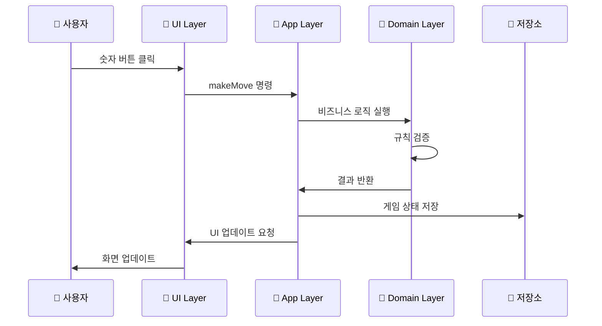
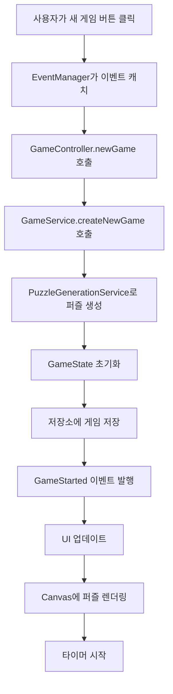
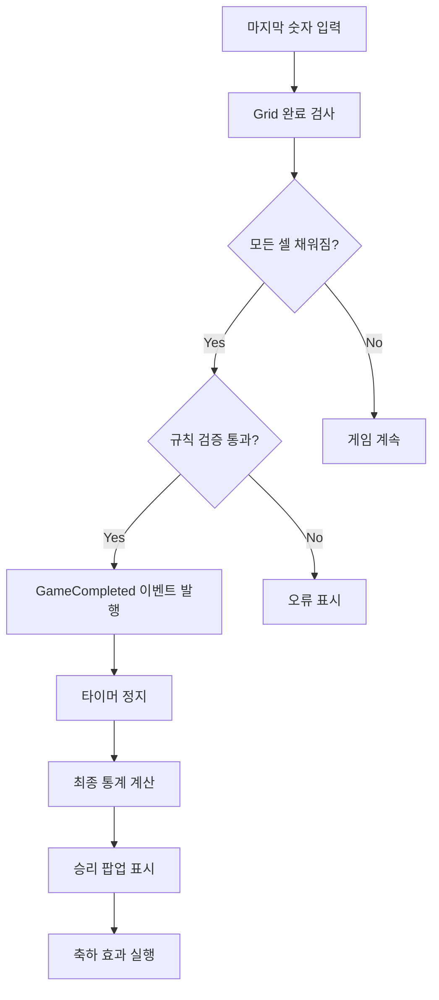

# 📚 스도쿠 게임 프로젝트 구조 설명서

> 초급 개발자를 위한 완전 가이드

## 🎯 이 문서의 목적

이 문서는 **초급 개발자**가 복잡한 프로젝트 구조를 이해하고, **도메인 주도 설계(DDD)**와 **클린 아키텍처**를 학습할 수 있도록 작성되었습니다.

---

## 📋 목차

1. [전체 프로젝트 개요](#전체-프로젝트-개요)
2. [폴더 구조 한눈에 보기](#폴더-구조-한눈에-보기)
3. [레이어별 상세 설명](#레이어별-상세-설명)
4. [핵심 개념 이해하기](#핵심-개념-이해하기)
5. [파일별 역할 설명](#파일별-역할-설명)
6. [데이터 흐름 이해하기](#데이터-흐름-이해하기)
7. [디자인 패턴 학습](#디자인-패턴-학습)
8. [개발자 성장 로드맵](#개발자-성장-로드맵)

---

## 🏗️ 전체 프로젝트 개요

### 프로젝트란?
**스도쿠 웹 게임**을 **TypeScript**와 **HTML5 Canvas**로 만든 프로젝트입니다.

### 왜 이렇게 복잡하게 만들었을까?
1. **유지보수성**: 코드를 수정하기 쉽게
2. **확장성**: 새로운 기능을 추가하기 쉽게
3. **테스트 용이성**: 버그를 쉽게 찾고 고치기 위해
4. **협업**: 여러 개발자가 함께 작업하기 쉽게

---

## 📁 폴더 구조 한눈에 보기

```
sudoku-ai/
├── 📄 package.json              # 프로젝트 정보 & 의존성
├── 📄 tsconfig.json            # TypeScript 설정
├── 📄 vite.config.ts           # 빌드 도구 설정
├── 📄 CLAUDE.md                # AI 개발 가이드
├── 📄 프로젝트 구조 설명서.md    # 이 문서!
│
└── 📂 src/                     # 📌 모든 소스 코드
    ├── 📂 domain/              # 🧠 비즈니스 로직 (핵심!)
    ├── 📂 application/         # 🔧 앱 서비스 & 사용 사례
    ├── 📂 infrastructure/      # 🔌 외부 연결 (저장소, 렌더링)
    ├── 📂 presentation/        # 🎨 사용자 인터페이스
    ├── 📄 main.ts             # 🚀 앱 시작점
    └── 📄 index.html          # 🌐 웹 페이지
```

---

## 🎯 레이어별 상세 설명

### 🧠 1. Domain Layer (도메인 레이어)
> **"스도쿠 게임의 핵심 규칙과 로직"**

```
📂 src/domain/
├── 📂 sudoku/
│   ├── 📂 aggregates/         # 🏢 큰 단위의 객체들
│   │   ├── Game.ts           # 게임 전체 관리
│   │   └── Grid.ts           # 9x9 스도쿠 판
│   │
│   ├── 📂 entities/          # 🏭 중요한 객체들
│   │   └── GameState.ts      # 게임 상태 (시간, 점수 등)
│   │
│   ├── 📂 value-objects/     # 💎 작은 값 객체들
│   │   ├── Position.ts       # 위치 (행, 열)
│   │   └── CellValue.ts      # 셀 값 (1~9, 빈칸)
│   │
│   ├── 📂 services/          # ⚙️ 복잡한 로직들
│   │   ├── GridValidationService.ts     # 규칙 검증
│   │   ├── PuzzleGenerationService.ts   # 퍼즐 생성
│   │   └── CompletionDetectionService.ts # 완료 감지
│   │
│   ├── 📂 events/            # 📢 이벤트들
│   │   └── SudokuDomainEvents.ts        # 게임 이벤트
│   │
│   └── 📂 rules/             # 📏 비즈니스 규칙들
│       └── SudokuBusinessRules.ts       # 스도쿠 규칙
│
└── 📂 common/                # 🔧 공통 기능들
    ├── 📂 events/           # 이벤트 시스템
    ├── 📂 rules/            # 규칙 엔진
    └── 📂 testing/          # 테스트 도구들
```

#### 🤔 Domain Layer가 하는 일
- **스도쿠 규칙 정의**: "같은 행에 같은 숫자가 있으면 안 돼!"
- **게임 상태 관리**: "지금 몇 분 걸렸지? 실수는 몇 번 했지?"
- **퍼즐 생성**: "난이도에 맞는 퍼즐을 만들어줘!"
- **승리 조건 확인**: "모든 칸이 올바르게 채워졌나?"

#### 💡 초급자 팁
- Domain Layer는 **UI나 데이터베이스를 몰라야 합니다**
- 순수한 **비즈니스 로직**만 있어야 해요
- 다른 프로젝트에서도 **재사용**할 수 있어야 합니다

---

### 🔧 2. Application Layer (애플리케이션 레이어)
> **"사용자가 하고 싶은 일을 처리해주는 곳"**

```
📂 src/application/
├── 📂 sudoku/
│   ├── 📂 commands/          # 📝 명령들 (변경 작업)
│   │   ├── CreateNewGameCommand.ts      # 새 게임 만들기
│   │   └── MakeMoveCommand.ts           # 숫자 입력하기
│   │
│   ├── 📂 queries/           # 🔍 조회들 (읽기 작업)
│   │   ├── GetGameQuery.ts              # 게임 정보 가져오기
│   │   └── GetGameHintQuery.ts          # 힌트 가져오기
│   │
│   ├── 📂 handlers/          # 🎯 처리기들
│   │   ├── CreateNewGameCommandHandler.ts # 새 게임 만들기 처리
│   │   └── MakeMoveCommandHandler.ts      # 숫자 입력 처리
│   │
│   ├── 📂 services/          # 🛠️ 애플리케이션 서비스
│   │   └── SudokuApplicationService.ts    # 전체 조율
│   │
│   ├── 📂 dtos/              # 📦 데이터 전송 객체
│   │   ├── CommandDtos.ts               # 명령용 데이터
│   │   └── QueryDtos.ts                 # 조회용 데이터
│   │
│   └── 📂 mappers/           # 🔄 변환기들
│       └── GameMapper.ts                # 객체 변환
│
└── 📂 common/                # 🔧 공통 기능
    ├── Command.ts           # 명령 인터페이스
    └── Query.ts             # 조회 인터페이스
```

#### 🤔 Application Layer가 하는 일
- **사용자 요청 처리**: "새 게임을 시작하고 싶어요!"
- **여러 도메인 조합**: 게임 생성 + 저장 + 화면 업데이트
- **트랜잭션 관리**: 여러 작업을 안전하게 묶어서 처리
- **권한 검사**: "이 사용자가 이 작업을 할 수 있나?"

#### 💡 초급자 팁
- **CQRS 패턴**: 명령(Command)과 조회(Query)를 분리
- **DTO**: 레이어 간 데이터 전송용 객체
- **Mapper**: 서로 다른 객체 형태를 변환

---

### 🔌 3. Infrastructure Layer (인프라스트럭처 레이어)
> **"외부 세계와 연결하는 곳"**

```
📂 src/infrastructure/
├── 📂 repositories/          # 💾 저장소들
│   └── LocalStorageGameRepository.ts   # 브라우저 저장소
│
├── 📂 rendering/             # 🎨 렌더링 엔진
│   ├── 📂 engines/           # 렌더링 엔진들
│   │   ├── CanvasRenderingEngine.ts    # Canvas 엔진
│   │   └── WebGLRenderingEngine.ts     # WebGL 엔진
│   │
│   ├── 📂 renderers/         # 렌더러들
│   │   └── CanvasGameRenderer.ts       # 게임 렌더러
│   │
│   └── GameRenderer.ts       # 렌더러 인터페이스
│
└── 📂 storage/               # 📁 저장 관련
    └── 📂 providers/
        └── LocalStorageProvider.ts     # 로컬 저장소
```

#### 🤔 Infrastructure Layer가 하는 일
- **데이터 저장**: "게임 진행 상황을 브라우저에 저장해줘!"
- **화면 렌더링**: "Canvas에 스도쿠 판을 그려줘!"
- **외부 API 호출**: "서버에서 데이터를 가져와줘!"
- **파일 시스템 접근**: "설정 파일을 읽어줘!"

#### 💡 초급자 팁
- Infrastructure는 **구현 세부사항**입니다
- **Repository 패턴**: 데이터 저장 방식을 추상화
- **언제든 교체 가능**: LocalStorage → 서버 DB로 쉽게 변경

---

### 🎨 4. Presentation Layer (프레젠테이션 레이어)
> **"사용자가 보고 만지는 모든 것"**

```
📂 src/presentation/
├── 📂 controllers/           # 🎮 컨트롤러들
│   └── GameController.ts                # 게임 컨트롤러
│
├── 📂 managers/              # 👥 관리자들
│   ├── DOMElementManager.ts             # DOM 요소 관리
│   ├── EventManager.ts                  # 이벤트 관리
│   ├── UIManager.ts                     # UI 업데이트 관리
│   └── TimerManager.ts                  # 타이머 관리
│
├── 📂 renderers/             # 🖼️ 렌더러들
│   ├── CanvasGameRenderer.ts            # 게임 렌더러
│   └── LineCompletionEffectsRenderer.ts # 이펙트 렌더러
│
└── 📂 config/                # ⚙️ 설정들
    ├── DOMSelectors.ts                  # HTML 선택자들
    └── AppConfig.ts                     # 앱 설정
```

#### 🤔 Presentation Layer가 하는 일
- **사용자 입력 처리**: "마우스 클릭, 키보드 입력 받기"
- **화면 업데이트**: "게임 상태 변경을 화면에 반영"
- **이벤트 관리**: "버튼 클릭 → 게임 로직 호출"
- **시각적 효과**: "라인 완성 시 반짝이는 효과"

#### 💡 초급자 팁
- **MVC 패턴**: Model-View-Controller 구조
- **관심사 분리**: UI 업데이트, 이벤트 처리, DOM 관리를 각각 분리
- **재사용성**: 다른 UI 프레임워크로 쉽게 교체 가능

---

## 🧭 핵심 개념 이해하기

### 1. 🏗️ Domain-Driven Design (DDD)
```
실제 비즈니스 → 코드로 모델링
"스도쿠 게임"  → "SudokuGame 클래스"
```

**DDD의 핵심 요소들:**
- **Entity**: 고유 식별자가 있는 객체 (예: Game, GameState)
- **Value Object**: 값으로만 구분되는 객체 (예: Position, CellValue)
- **Aggregate**: 관련된 객체들의 묶음 (예: Game + Grid + GameState)
- **Domain Service**: 복잡한 비즈니스 로직 (예: PuzzleGenerationService)

### 2. 🎯 CQRS (Command Query Responsibility Segregation)
```
명령 (Command) ←→ 조회 (Query) 분리

CREATE_NEW_GAME_COMMAND  |  GET_GAME_QUERY
MAKE_MOVE_COMMAND        |  GET_HINT_QUERY
```

**왜 분리할까?**
- **명확성**: 읽기와 쓰기 로직이 섞이지 않음
- **성능**: 각각 최적화 가능
- **확장성**: 읽기 전용 데이터베이스 등 활용 가능

### 3. 📢 Event-Driven Architecture (이벤트 기반 아키텍처)
```
게임 완료 → GameCompleted 이벤트 발생 → 여러 핸들러가 반응

📢 GameCompleted Event
├── 🏆 UI에 축하 메시지 표시
├── 📊 통계 업데이트
├── 🎵 승리 사운드 재생
└── 💾 최고 기록 저장
```

### 4. 🧅 Clean Architecture (클린 아키텍처)
```
의존성 방향: 바깥쪽 → 안쪽

Presentation → Application → Domain
     🎨           🔧         🧠
```

**핵심 원칙:**
- **의존성 역전**: 안쪽 레이어는 바깥쪽을 모름
- **관심사 분리**: 각 레이어는 고유한 책임
- **테스트 용이성**: 각 레이어를 독립적으로 테스트

---

## 📄 파일별 역할 설명

### 🚀 시작점 파일들

#### `src/main.ts` - 앱의 심장
```typescript
// 앱 전체를 시작하고 연결하는 역할
class SudokuApp {
  // 1. 의존성 주입으로 모든 서비스 생성
  // 2. 매니저들을 연결
  // 3. 이벤트 리스너 설정
  // 4. 첫 게임 시작
}
```

#### `src/index.html` - 웹페이지 구조
```html
<!-- 스도쿠 게임이 표시될 HTML 구조 -->
<canvas id="gameCanvas"></canvas>
<div id="gameInfo">시간, 힌트 등</div>
<div id="numberButtons">1~9 버튼들</div>
```

### 🧠 핵심 비즈니스 로직

#### `src/domain/sudoku/aggregates/Game.ts`
```typescript
// 스도쿠 게임 전체를 나타내는 최상위 객체
export class SudokuGame {
  // 게임 ID, 그리드, 상태를 모두 관리
  // 게임의 생명주기 전체를 책임짐
}
```

#### `src/domain/sudoku/aggregates/Grid.ts`
```typescript
// 9x9 스도쿠 판을 나타내는 객체
export class SudokuGrid {
  // 81개 셀을 관리
  // 행/열/박스 검증 로직
  // 퍼즐 생성과 완료 체크
}
```

### 🔧 애플리케이션 서비스들

#### `src/application/services/GameService.ts`
```typescript
// 게임 관련 모든 작업을 조율하는 서비스
export class GameService {
  async createNewGame() { /* 새 게임 생성 */ }
  async makeMove() { /* 숫자 입력 처리 */ }
  async getHint() { /* 힌트 제공 */ }
  // 도메인 로직 + 저장소 + 이벤트를 조합
}
```

### 🎨 UI 관련 파일들

#### `src/presentation/controllers/GameController.ts`
```typescript
// 사용자 입력을 받아서 게임 서비스로 전달
export class GameController {
  handleCellClick() { /* 셀 클릭 처리 */ }
  handleNumberInput() { /* 숫자 입력 처리 */ }
  handleGameComplete() { /* 게임 완료 처리 */ }
}
```

#### `src/presentation/managers/UIManager.ts`
```typescript
// UI 업데이트만 담당하는 매니저
export class UIManager {
  updateGameInfo() { /* 게임 정보 표시 */ }
  showGameComplete() { /* 완료 팝업 표시 */ }
  updateTimer() { /* 타이머 업데이트 */ }
}
```

---

## 🌊 데이터 흐름 이해하기

### 📝 사용자가 숫자를 입력할 때



### 🎮 새 게임을 시작할 때



### 🏆 게임 완료 시



---

## 🎨 디자인 패턴 학습

### 1. 🏭 Factory Pattern (팩토리 패턴)
```typescript
// 📍 위치: src/domain/effects/services/EffectFactory.ts
class EffectFactory {
  static createRowEffect(rowIndex: number): LineCompletionEffect {
    // 행 완성 효과 생성
  }

  static createColumnEffect(colIndex: number): LineCompletionEffect {
    // 열 완성 효과 생성
  }
}

// 사용법
const effect = EffectFactory.createRowEffect(3);
```

**왜 사용할까?**
- 객체 생성 로직을 한 곳에 모음
- 생성 방식이 복잡할 때 유용
- 나중에 생성 로직을 바꾸기 쉬움

### 2. 📚 Repository Pattern (저장소 패턴)
```typescript
// 📍 위치: src/domain/sudoku/repositories/GameRepository.ts
interface GameRepository {
  save(game: SudokuGame): Promise<void>;
  load(gameId: string): Promise<SudokuGame | null>;
  delete(gameId: string): Promise<void>;
}

// 구현체: src/infrastructure/repositories/LocalStorageGameRepository.ts
class LocalStorageGameRepository implements GameRepository {
  // 브라우저 localStorage에 저장
}
```

**왜 사용할까?**
- 데이터 저장 방식을 추상화
- 나중에 다른 저장소로 쉽게 변경
- 테스트 시 가짜 저장소 사용 가능

### 3. 📢 Observer Pattern (관찰자 패턴)
```typescript
// 📍 위치: src/domain/common/events/DomainEventPublisher.ts
class DomainEventPublisher {
  private handlers = new Map<string, EventHandler[]>();

  subscribe(eventType: string, handler: EventHandler) {
    // 이벤트 구독
  }

  publish(event: DomainEvent) {
    // 모든 구독자에게 이벤트 전달
  }
}
```

**왜 사용할까?**
- 객체 간 느슨한 결합
- 이벤트 기반 아키텍처 구현
- 새로운 기능을 기존 코드 수정 없이 추가

### 4. 🎭 Command Pattern (명령 패턴)
```typescript
// 📍 위치: src/application/sudoku/commands/
interface Command<T> {
  readonly type: string;
  readonly request: T;
}

class MakeMoveCommand implements Command<MakeMoveRequest> {
  readonly type = 'MAKE_MOVE_COMMAND';
  constructor(public readonly request: MakeMoveRequest) {}
}
```

**왜 사용할까?**
- 요청을 객체로 캡슐화
- 실행 취소(Undo) 기능 구현 가능
- 요청을 큐에 저장하거나 로깅 가능

---

## 🛠️ 개발 도구들

### 📦 Package.json 주요 스크립트
```json
{
  "scripts": {
    "dev": "vite",              // 개발 서버 실행
    "build": "tsc && vite build", // 프로덕션 빌드
    "preview": "vite preview",   // 빌드 미리보기
    "test": "jest",             // 테스트 실행
    "lint": "eslint src/",      // 코드 검사
    "typecheck": "tsc --noEmit" // 타입 검사만
  }
}
```

### ⚙️ TypeScript 설정
```json
// tsconfig.json
{
  "compilerOptions": {
    "strict": true,              // 엄격한 타입 검사
    "target": "ES2020",         // 컴파일 대상
    "module": "ESNext",         // 모듈 시스템
    "paths": {                  // 경로 별칭
      "@/*": ["src/*"]
    }
  }
}
```

### 🏗️ Vite 설정
```typescript
// vite.config.ts
export default defineConfig({
  plugins: [/* 플러그인들 */],
  resolve: {
    alias: {
      '@': path.resolve(__dirname, 'src')  // @ = src 폴더
    }
  }
});
```

---

## 🧪 테스트 구조

### 📁 테스트 파일 위치
```
src/
├── domain/
│   └── __tests__/          # 도메인 로직 테스트
├── application/
│   └── __tests__/          # 애플리케이션 서비스 테스트
└── infrastructure/
    └── __tests__/          # 인프라 레이어 테스트
```

### 🔧 테스트 유틸리티
```typescript
// src/domain/common/testing/DomainTestUtils.ts
class TestDataBuilder {
  static createEmptyGrid(): SudokuGrid { /* 빈 그리드 생성 */ }
  static createPosition(row: number, col: number): Position { /* 위치 생성 */ }
  static createGameState(): GameState { /* 게임 상태 생성 */ }
}
```

---

## 📈 개발자 성장 로드맵

### 🥉 초급 개발자 (지금의 당신!)
**현재 학습 목표:**
- [ ] 각 폴더의 역할 이해하기
- [ ] 파일 하나씩 읽어보며 코드 흐름 파악하기
- [ ] 간단한 기능 수정해보기 (UI 텍스트 변경 등)

**추천 학습 순서:**
1. `src/main.ts` → 시작점 이해
2. `src/presentation/` → UI 코드 파악
3. `src/domain/` → 비즈니스 로직 이해
4. `src/application/` → 서비스 레이어 학습

### 🥈 중급 개발자로 성장하기
**목표:**
- [ ] 새로운 기능 추가하기 (예: 다크 모드)
- [ ] 테스트 코드 작성하기
- [ ] 리팩토링 경험하기
- [ ] 다른 디자인 패턴 적용하기

### 🥇 고급 개발자로 성장하기
**목표:**
- [ ] 아키텍처 설계하기
- [ ] 성능 최적화하기
- [ ] 대규모 프로젝트 구조 설계하기
- [ ] 팀을 이끌고 코드 리뷰하기

---

## 🔍 문제 해결 가이드

### 🐛 버그가 발생했을 때
1. **브라우저 콘솔** 확인 (F12)
2. **로그 메시지** 추적하기
3. **데이터 흐름** 따라가기
4. **단위 테스트** 실행하기

### 📖 코드를 이해하기 어려울 때
1. **파일명과 폴더명**부터 파악
2. **인터페이스와 타입** 먼저 보기
3. **주석과 문서** 읽기
4. **테스트 코드** 참고하기

### 🚀 새로운 기능을 추가하고 싶을 때
1. **요구사항** 명확히 정의
2. **어느 레이어**에서 작업할지 결정
3. **기존 패턴** 따라하기
4. **테스트** 먼저 작성하기

---

## 💡 실습 과제

### 🎯 Level 1: 텍스트 변경하기
```typescript
// src/presentation/config/AppConfig.ts에서
export const MESSAGES = {
  GAME_COMPLETE: '🎉 축하합니다!',  // ← 이 메시지를 바꿔보세요!
}
```

### 🎯 Level 2: 새로운 UI 요소 추가하기
```typescript
// src/presentation/managers/UIManager.ts에서
// 실수 횟수를 화면에 표시하는 기능 추가해보기
```

### 🎯 Level 3: 새로운 이벤트 추가하기
```typescript
// src/domain/sudoku/events/SudokuDomainEvents.ts에서
// HintUsed 이벤트 추가하고 관련 핸들러 만들어보기
```

---

## 📚 추가 학습 자료

### 📖 추천 도서
- "클린 아키텍처" - 로버트 C. 마틴
- "도메인 주도 설계" - 에릭 에반스
- "리팩토링" - 마틴 파울러

### 🌐 온라인 자료
- [TypeScript 공식 문서](https://www.typescriptlang.org/)
- [DDD 패턴 가이드](https://docs.microsoft.com/en-us/dotnet/architecture/)
- [Clean Architecture 블로그](https://blog.cleancoder.com/)

### 🎥 영상 강의
- "도메인 주도 설계 실무 적용"
- "클린 아키텍처와 SOLID 원칙"
- "TypeScript 심화 과정"

---

## ❓ 자주 묻는 질문 (FAQ)

### Q1: 왜 이렇게 복잡하게 만들었나요?
**A:** 작은 프로젝트지만 **확장 가능하고 유지보수하기 쉬운** 구조로 만들기 위해서입니다. 실제 업무에서는 이런 구조가 필수입니다.

### Q2: 모든 프로젝트를 이렇게 만들어야 하나요?
**A:** 아닙니다! 프로젝트 크기에 맞게 조절해야 합니다. 하지만 이런 **패턴과 원칙**을 알아두면 도움이 됩니다.

### Q3: 어떤 파일부터 봐야 할까요?
**A:** `src/main.ts` → `src/presentation/` → `src/domain/` 순서로 보세요.

### Q4: 테스트는 어떻게 실행하나요?
**A:** `npm test` 명령어로 실행할 수 있습니다.

### Q5: 코드를 수정했는데 화면에 반영이 안 돼요.
**A:** `npm run dev`로 개발 서버가 실행 중인지 확인하고, 브라우저를 새로고침 해보세요.

---

## 🎉 마무리

이 프로젝트는 **단순한 스도쿠 게임**이 아닙니다.
**실무에서 사용되는 고급 아키텍처 패턴들**을 학습할 수 있는 교육용 프로젝트입니다.

처음에는 복잡해 보일 수 있지만, 차근차근 따라가다 보면 **좋은 코드 구조**의 힘을 느낄 수 있을 것입니다.

**행운을 빕니다!** 🚀

---

> 📝 **작성일**: 2024년
> 👨‍💻 **작성자**: Claude Code Assistant
> 🔄 **최종 수정**: 게임 완료 팝업 기능 구현 후